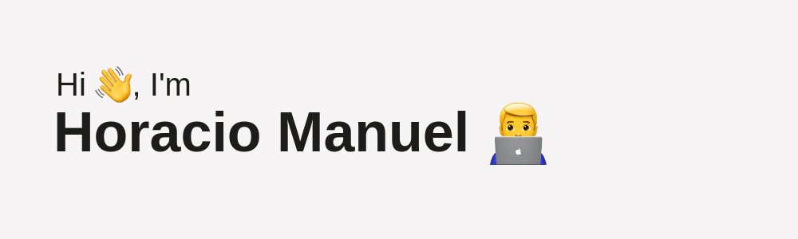

# h0r4ci0@github:~$ whoami

Soy un estudiante de 16 años apasionado por el mundo de la tecnología, especialmente por la ingeniería informática, las telecomunicaciones y la seguridad informática. Recientemente me gradué de la ESO y tengo muchas ganas de comenzar mi trayectoria académica en la UPV con un doble grado de ingeniería informática y telecomunicaciones, con la meta de alcanzar un máster en seguridad informática.

Pero todavía hay tiempo, recién me estreno en bachiller 😵‍💫.

### Objetivos profesionales
La verdad es que he tenido suerte en cuanto a mis objetivos, y es que los he tenido bastante claros desde pequeño.

Mi sueño es dedicarme al pentesting y a la ciberseguridad, áreas que me encantan por su constante evolución y los desafíos que presentan. Por el momento, me decanto por el Red Team 🙂

Una meta que tengo establecida es aportar mi granito de arena para hacer de esta sociedad cada vez más digitalizada, un lugar todavía más seguro.

### Hobbies
A lo largo de mi tiempo libre, aunque escaso ahora con bachiller ☠️, disfruto explorando y experimentando con Linux, servidores y algunos proyectos que suelo hacer los fines de semana con raspberries y arduinos... A su vez, también dedico parte de este tiempo ampliando mis conocimientos sobre hacking, criptografía, redes y cualquier otra cosa que me genere curiosidad.

### Habilidades
Si tuviera que definirme, me describiría como una persona autodidacta, curiosa, con habilidades analíticas y mucha paciencia. Puede sonar raro, pero me encanta afrontar problemas que me hagan pensar durante horas o incluso a veces días.

Dicen que una de las mejores formas que tiene el ser humano de aprender es a base de prueba y error, y yo estoy totalmente de acuerdo. Si no fuera por los problemas que se me han presentado a lo largo de mi vida, probablemente nunca hubiera llegado a tener los conocimientos que tengo hoy en día, y los que llegaré a tener.

### Proyectos
#### Proyectos actuales
Como he dicho anteriormente, estoy en bachiller. Y para rascar algo de nota, tengo la posibilidad de presentar un trabajo de investigación. Por tanto, como me apasionan las nuevas tecnologías, estoy realizando un proyecto que involucra inteligencia artificial y análisis de señales. Ya cuando lo presente, haré una buena descripción de él.

<picture>
    <source media="(prefers-color-scheme: dark)" srcset="https://api.roadmap.sh/v1-badge/tall/65650cbc5145316d257fd918?variant=light">
    
</picture>

Por otra parte, como también he mencionado antes, los fines de semana suelo hacer algún mini proyecto que luego subo a mi GitHub o comparto por redes. Ahora mismo, estoy trabajando en abrir la puerta de mi patio con el móvil, pronto subiré un repo explicándolo 😉

### Intereses
Si has llegado hasta aquí, sabrás que me apasionan las nuevas tecnologías. Pero también me encanta divulgar sobre lo que voy aprendiendo. Es por ello que tengo un blog llamado "Un pingüino curioso", donde tengo varios artículos. También suelo escribir en otros medios como en sospedia.net (muy buen blog de tecnología 🙂) y estoy pensando en escribir para el periódico de mi instituto. Por otra parte, hablo sobre tecnología en mi cuenta de Twitter y en algunas charlas/presentaciones en mi instituto.

### Relaciones
Una de las cosas que no me gusta sobre este mundillo es que encontrar a gente que le muevan las mismas cosas que a mí y que sean de mi edad es realmente difícil. O por lo menos para mí.

Por lo que si compartes mi pasión por la tecnología y buscas a alguien motivado y comprometido, me encantaría charlar contigo 😄. No dudes en contactarme para intercambiar ideas o simplemente charlar.

¡Gracias!

## Contacto

  

